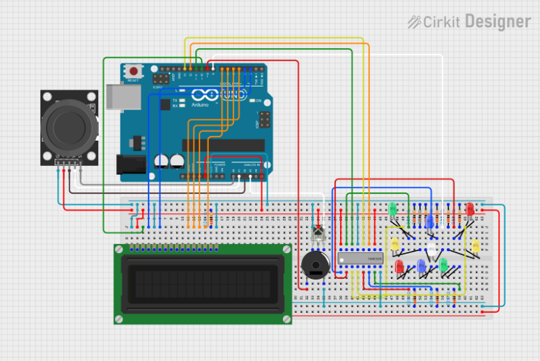
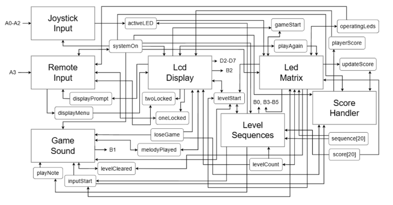
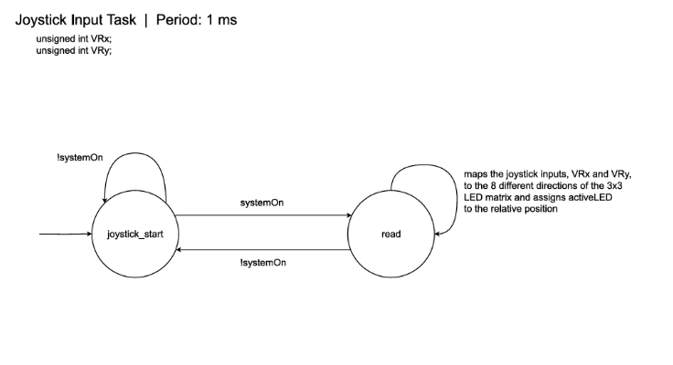
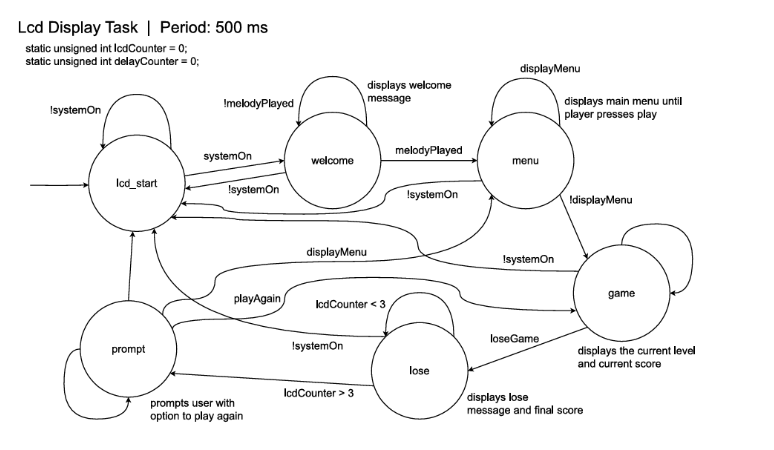
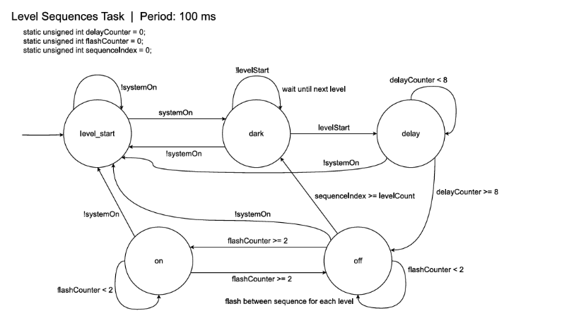
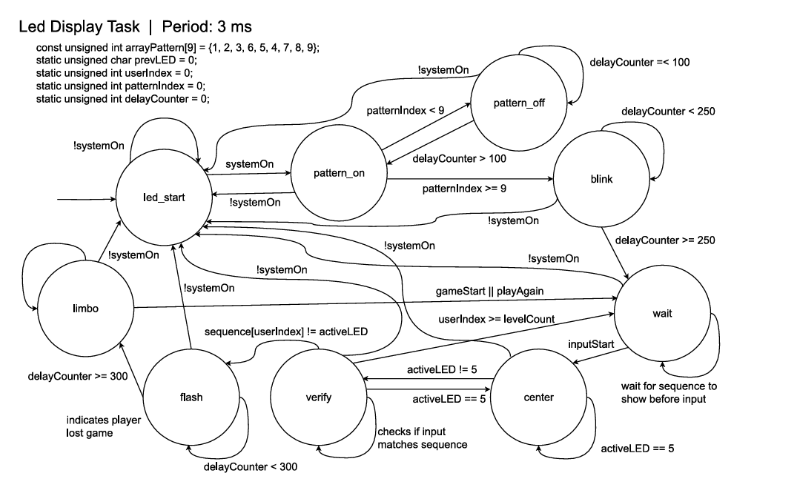
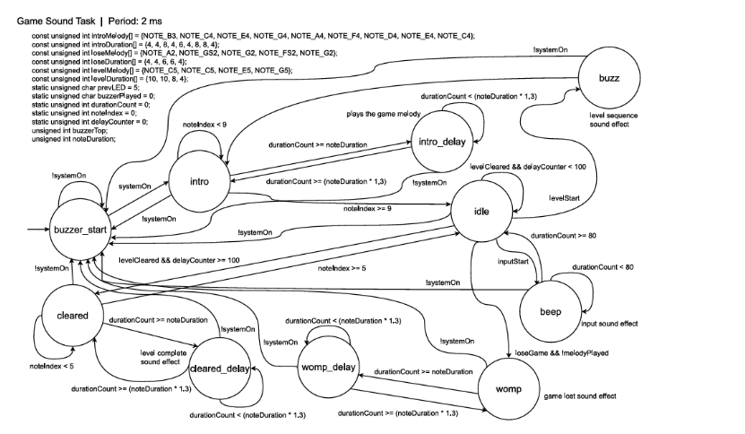

# Enchanced Simon

## Introduction
In my own implementation of the real-time Simon memorization game, “Enhanced Simon,” consists of inspired elements of the original game, but also includes new, unique features as well. In the original game, a player will have to memorize and correctly input a sequence of flashing lights in the correct order. If a player “wins” a level, they proceed to the next one. If they “lose” by submitting the wrong sequence, the game will end. In this game, a player will have to memorize and correctly input a sequence of flashing lights consisting of a random combination of four different colors in the correct order. If a player “wins” a level, they proceed to the next. If they “lose” by submitting the wrong sequence, the game will end. If the player takes too long to complete the level, they will automatically lose, and the game will end. 

In my version of the game, “Enhanced Simon,” I increased the complexity of the game by doubling the amount of lights to eight lights in total. This vastly increases the different levels of light combinations the player will have to memorize. The lights are organized in a 3x3 LED matrix with the neutral point being the center LED as a reference point for the player as they traverse the matrix. The player will be playing the game through a joystick mapped to the eight different lights. Enhanced Simon features dynamic score calculations for each completed level with a variety of sound effects with infinite levels scaling with increased difficulty.

## Hardware Components
- LCD Screen
- LED (x9)
- 220 Ohm Resistor (x10)
- Wires
- IR Remote/Receiver
- Passive Buzzer
- Shift Register

## Software Libraries
- <stdio.h>
- <stdlib.h>
- <time.h>
- "timerISR.h"
- "helper.h"
- "periph.h"
- "LCD.h"
- "irAVR.h"
- "pitches.h"

## Circuit Diagram

## Task Diagram

## SyncSM Diagrams

