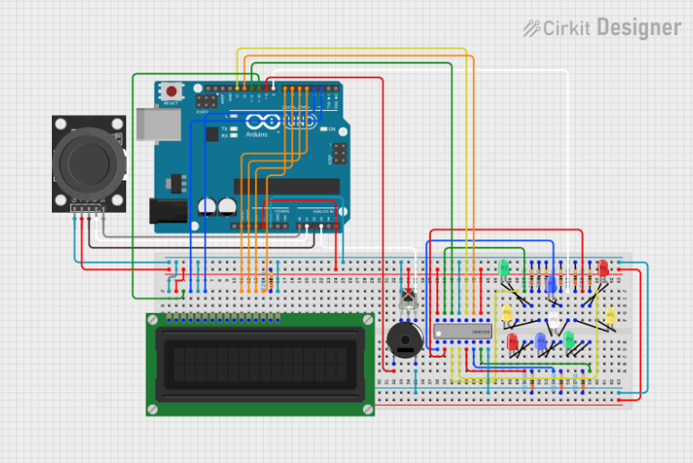
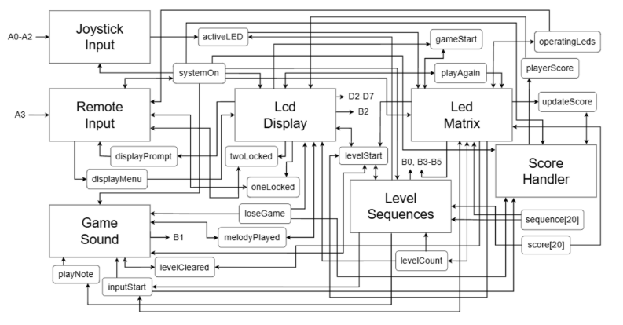
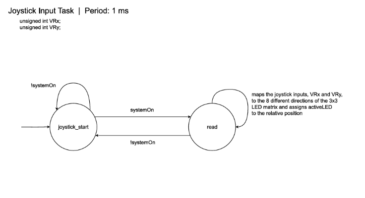
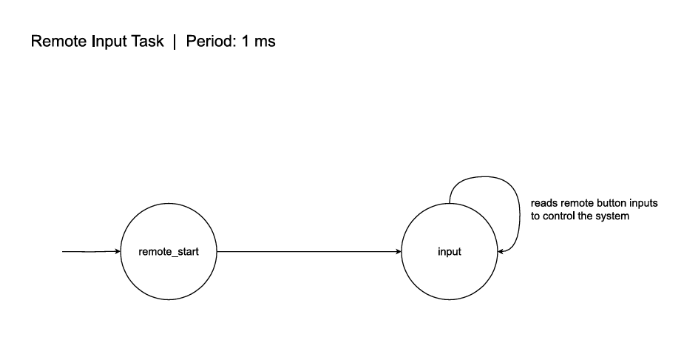
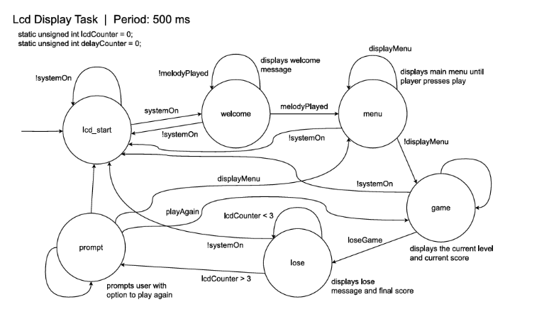
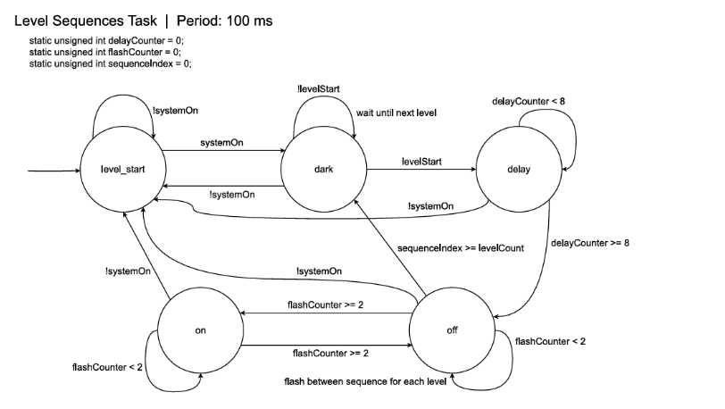
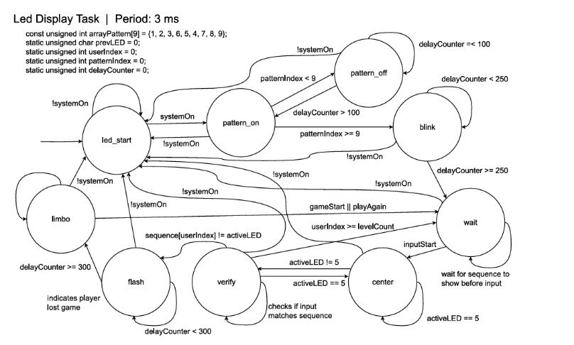
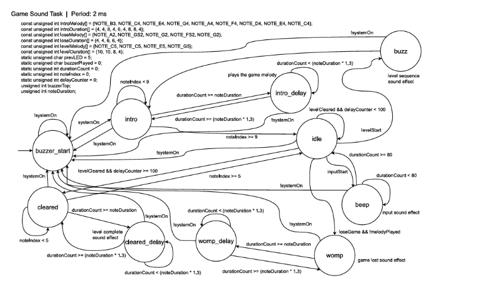
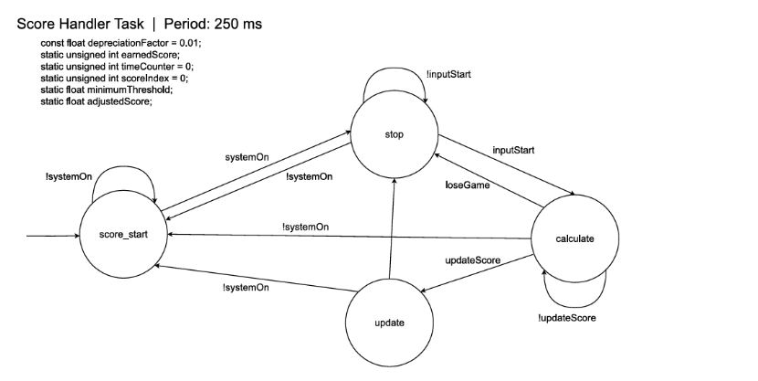

# Enchanced Simon
## Introduction
In my own implementation of the real-time Simon memorization game, "Enhanced Simon," consists of inspired elements of the original game, but also includes new, unique features as well. In the original game, a player will have to memorize and correctly input a sequence of flashing lights in the correct order. If a player "wins" a level, they proceed to the next one. If they "lose" by submitting the wrong sequence, the game will end. In this game, a player will have to memorize and correctly input a sequence of flashing lights consisting of a random combination of four different colors in the correct order. If a player "wins" a level, they proceed to the next. If they "lose" by submitting the wrong sequence, the game will end. If the player takes too long to complete the level, they will automatically lose, and the game will end. 
In my version of the game, "Enhanced Simon," I increased the complexity of the game by doubling the amount of lights to eight lights in total. This vastly increases the different levels of light combinations the player will have to memorize. The lights are organized in a 3x3 LED matrix with the neutral point being the center LED as a reference point for the player as they traverse the matrix. The player will be playing the game through a joystick mapped to the eight different lights. Enhanced Simon features dynamic score calculations for each completed level with a variety of sound effects with infinite levels scaling with increased difficulty.

## Hardware Components
- LCD Screen
- LED (x9)
- 220 Ohm Resistor (x10)
- Wires
- IR Remote/Receiver
- Passive Buzzer
- Shift Register

## Software Libraries
- <stdio.h>
- <stdlib.h>
- <time.h>
- "timerISR.h"
- "helper.h"
- "periph.h"
- "LCD.h"
- "irAVR.h"
- "pitches.h"

## Circuit Diagram


## Task Diagram


## SyncSM Diagrams








## Setup & Installation

### Prerequisites
Before getting started, make sure you have the following installed:
- [Visual Studio Code](https://code.visualstudio.com/)
- [PlatformIO IDE extension](https://platformio.org/install/ide?install=vscode) for VS Code
- All hardware components listed above

### Installation
1. Clone the repository
```bash
   git clone <repository-url>
   cd enhanced-simon
```
2. Open the project in VS Code
```bash
   code .
```
3. PlatformIO will automatically detect the `platformio.ini` configuration file and prompt you to install any necessary dependencies. Allow it to do so.

### Wiring
Refer to the circuit diagram above for the full wiring configuration. Ensure all components are connected before uploading the program.

### Building & Uploading
1. Connect your microcontroller to your machine via USB
2. In VS Code, open the PlatformIO toolbar on the left sidebar
3. Click **Build** to compile the project and verify there are no errors
4. Click **Upload** to flash the program to your microcontroller

### Running the Game
Once uploaded, power on the microcontroller. The LCD screen will display a welcome message. Use the joystick to navigate the LED matrix and the IR remote to start the game.

### Troubleshooting
- **PlatformIO dependencies not installing** — try running `PlatformIO: Update All` from the VS Code command palette
- **Upload failing** — ensure the correct port is selected in `platformio.ini` and that your microcontroller is properly connected
- **LEDs not lighting up** — double check resistor placement and shift register wiring against the circuit diagram
- **No sound** — verify the buzzer is connected to a PWM-capable pin
- **IR remote not responding** — ensure the receiver is oriented correctly and the remote is within range
